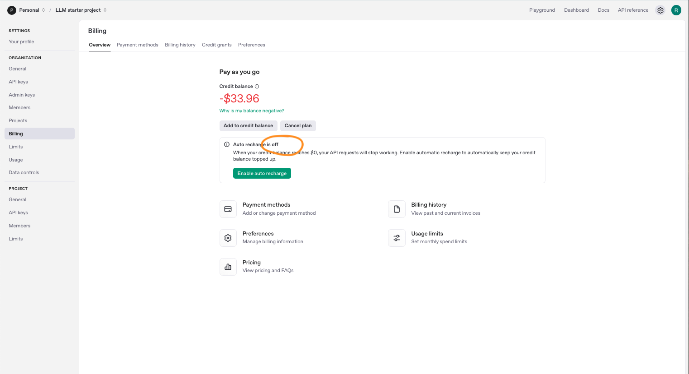
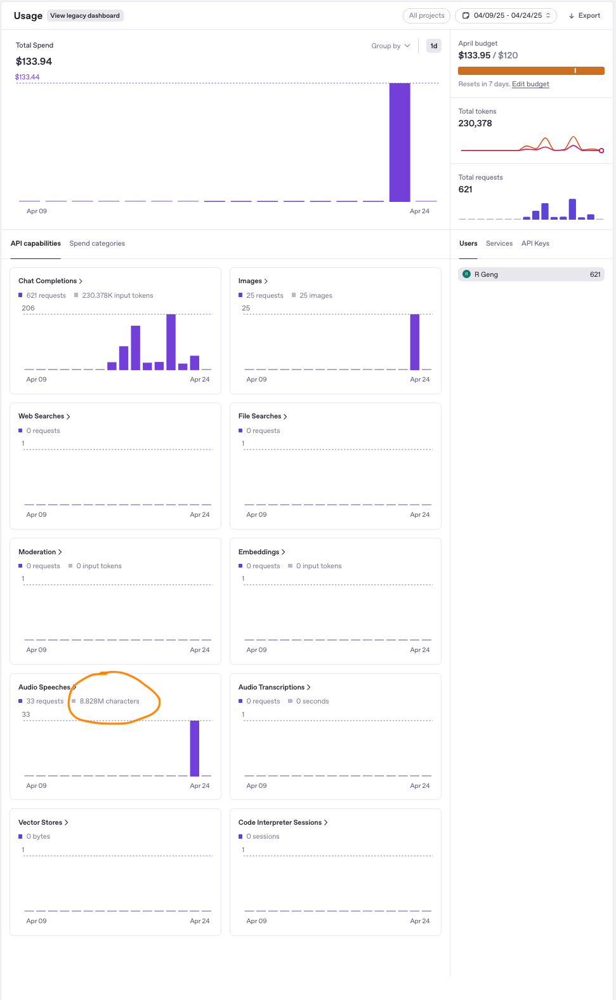
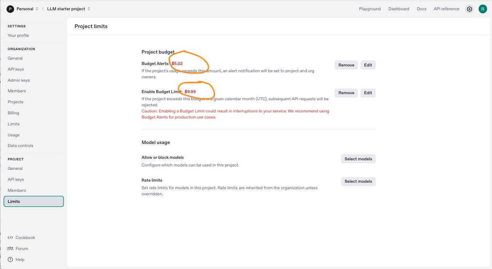

# OpenAI API Billing Incident

I'm currently learning from the Udemy course [**LLM Engineering: Master AI, Large Language Models & Agents**](https://www.udemy.com/course/llm-engineering-master-ai-and-large-language-models), taught by [Ed Donner](https://www.linkedin.com/in/eddonner/).

On **April 23, 2025**, while working on code from **Week 2, Day 5**, I accidentally triggered a billing incident that cost me **$132.42 within 30 minutes**.

> 🔗 **GitHub Repository:**  
> [github.com/rjgeng/openai_api_billing_incident](https://github.com/rjgeng/openai_api_billing_incident)

---

## 🔥 What Happened

While rewriting the original `day5.ipynb` into a Python script (`day5.py`) and enhancing it into a Gradio app (`airline_multi-modal.py`), I encountered two critical issues:

- ❌ **No usage limit set** → default `Tier 1` allowed charges up to $120 without real-time warnings.
- ❌ **Loop in TTS code** → called `talker()` with a large `chatlog.md` response file multiple times.

The result:
- ~**25 DALL·E 3 image generations** (~$40)
- ~**8.8 million characters** sent to **TTS** (~$80+)
- Several `429 Too Many Requests` errors appeared, but billing kept accruing silently.

---

## 📸 Screenshots

### 🧾 Billing Summary  


### 📊 Usage Overview  


### ⚙️ API Limit Page  


---

## 🕒 Postmortem Timeline 

| Time       | Event Description                                                                                    |
|------------|-------------------------------------------------------------------------------------------------     |
| 09:06 AM   | Started running `airline_multi-modal.py` with TTS + DALL·E                                           |
| 09:06 AM   | `chatlog.md` generated, triggered TTS, then app crashed (Error 429), assumed no cost incurred        |
| 09:30 AM   | Realized billing hit negative **-$87.66** after refresh bill page                                    |
| 09:49 AM   | Added $90 → Balance shown as +$12.34                                                                 |
| 10:15 AM   | Re-running `airline_multi-modal.py` with TTS + DALL·E, `chatlog.md` re-generated                     |
| 10:15 AM   | Account dropped to **-$33.96**, total cost **$132.42**                                               |

---

## 🧠 Lessons Learned

- ✅ Set **monthly usage caps** immediately.
- ✅ TTS is priced by **character count**, not by number of calls.
- ✅ Always implement **error handling** and **retry limits**.
- ✅ Use logs sparingly with TTS or audio APIs — large logs = big bills.
- ✅ Monitor billing via **API**, not just the web dashboard.

---

## 🧩 Code Snippet – TTS Triggered Loop

```python
if enable_tts:
    try:
        talker(reply)
    except RateLimitError:
        history.append({"role": "assistant", "content": "⚠️ TTS quota exceeded."})
